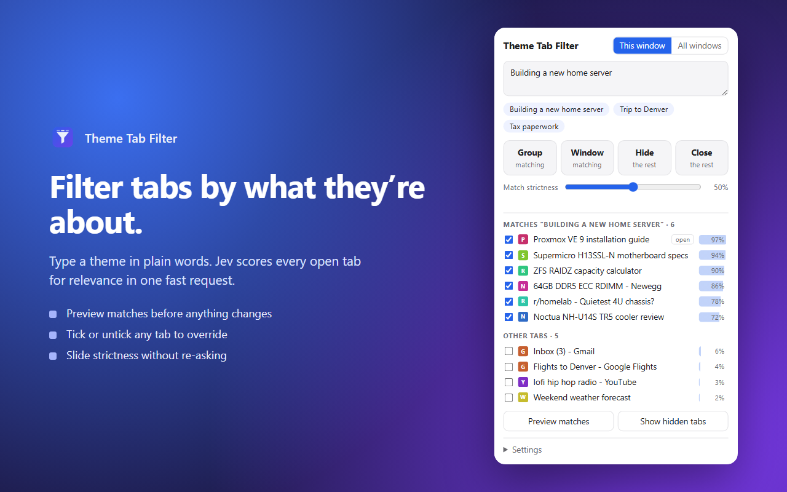

# Theme Tab Filter for Jev

**Group, hide, or close Chrome tabs by what they're about.** Type a theme in plain words, such as *"Building a new home server"*, and every open tab is scored for relevance by [TypeSafe's Jev model](https://docs.typesafe.ai/concepts/system-one) in one fast request.

<!-- STORE_LINK -->



## Actions

| Button | What it does |
|---|---|
| **Group** | Pulls every matching tab into one tab group named after the theme |
| **Window** | Moves every matching tab into a new window |
| **Hide** | Folds everything else into a collapsed grey "Hidden · theme" group. **Show hidden tabs** brings them back |
| **Close** | Closes everything else, only after a second confirming click. **Undo close** reopens them |

Other features:

- **Preview before acting.** Press Enter or click **Preview matches** to see the scored list.
- **Overrides.** Tick or untick any tab to overrule the model.
- **Match strictness.** The slider moves the cutoff instantly, without new API calls.
- **Scope.** Filter this window or all windows.
- **Recent themes.** Your last 8 themes are one click away.
- **Shortcut.** `Alt+Shift+F` opens the popup.
- **Safety.** The tab you're on and pinned tabs are never hidden or closed.

## Setup

1. Get a TypeSafe Jev API key.
2. Install from the Chrome Web Store, or load from source (below).
3. Open the popup, expand **Settings**, and paste your key.

### Load from source

1. Clone this repo.
2. Open `chrome://extensions` and enable **Developer mode**.
3. Click **Load unpacked** and pick the repo folder.

Requires Chrome 117 or newer.

## How it works

The popup sends one request to `https://api.typesafe.ai/v1/systemone`. The state is your theme, plus one `noul` (yes/no probability) question per tab built from its title and URL. Tabs scoring at or above the strictness cutoff count as matching. Scores are cached per theme and URL in `chrome.storage.session` until Chrome restarts.

Everything lives in three files: [`manifest.json`](manifest.json), [`popup.html`](popup.html) and [`popup.js`](popup.js). No build step, no dependencies.

## Privacy

Tab titles, URLs, and your theme go only to `api.typesafe.ai`, using your own key, and only when you click. There is no server, analytics, or tracking. See [PRIVACY.md](PRIVACY.md).

## Packaging a release

```powershell
./package.ps1
```

This writes `dist/theme-tab-filter-<version>.zip` containing only the extension files, ready to upload to the Chrome Web Store.

## License

[MIT](LICENSE). Not affiliated with or endorsed by TypeSafe.
